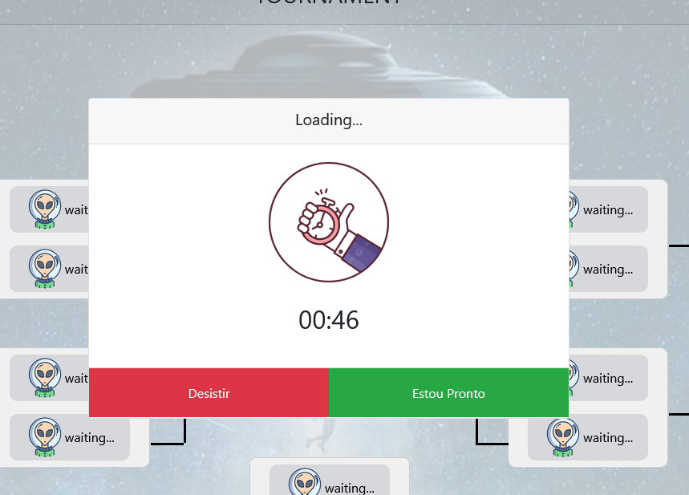

# ft_transcendence
Front-End do projeto ft_transcendence da 42 School

### Recursos:
- Foi utilizado bootstrap 4 (HTML5, CSS3, JQuery);
  - *O único recurso permitido nos requisitos do projeto;*
- Imagens para decorar diversas partes da aplicação;
- A aplicação é um SPA então cada tela na verdade é um "fragmento" que será inserido na tela base;

---
## Artefatos criados para o projeto:
- ✅ tela base
- ✅ fragment navbar
- ✅ fragment painel login
- ✅ fragment "esqueci minha senha"
- ✅ fragment perfil usuario
- 🚧 fragment perfil público
- 🚧 fragment histórico partidas
- ✅ fragment torneio
- ✅ fragment chat
- 🚧 fragment badges
- 🚧 fragment match

## TELA BASE

## FRAGMENT NAVBAR

## FRAGMENT PAINEL LOGIN

## FRAGMENT "ESQUECI MINHA SENHA"

## FRAGMENT PERFIL USUARIO

## FRAGMENT PERFIL PÚBLICO

## FRAGMENT HISTÓRICO PARTIDAS

## FRAGMENT TORNEIO

## FRAGMENT CHAT

## FRAGMENT BADGES

## FRAGMENT MATCH

