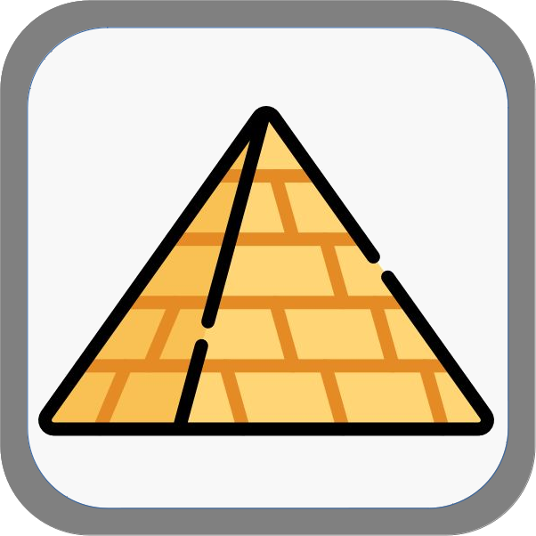
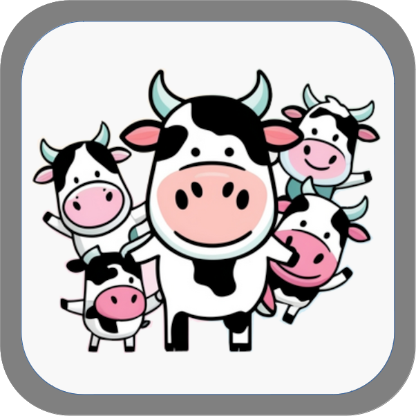

## badges

1. Complete Profile

    1.1 Towel - Complete the Profile with New photo and Description.
    
   

  

2. Invite Peoples

    2.1 Piramid - Invite 3 Friends to Play the game.
    
    

  

3. Advance in a tournament

    3.1 Galaxy - Reaching the final stage of a tournament.
    
    

  

4. Use Chat

    4.1 First Contact - Chat with other players.
    
    

  

5. Cow Savior

    5.1 Cow Savior - Save 50 cows from abduction.
    
    

  

6. Add friends

    6.1 Coalition - Add another player as a friend.
    
    

  

7. First Win

    7.1 First Win - Win your first match.
    
    

  

8. Reach the end of the tournament

    7.1 Winner - Win a tournament in first place.
    
    

  

9. Reach the end of the tournament

    9.1 Second place - Win a tournament in second place.
    
    

  

10. Reach the end of the tournament

    10.1 Win a tournament in third place.
     
    
